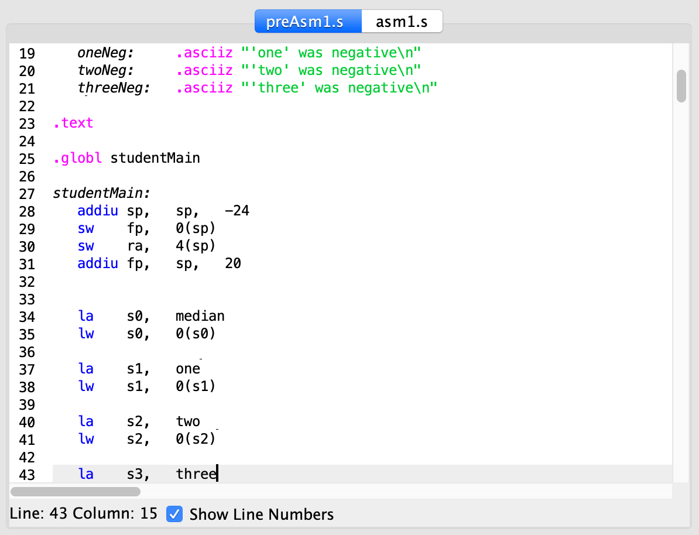
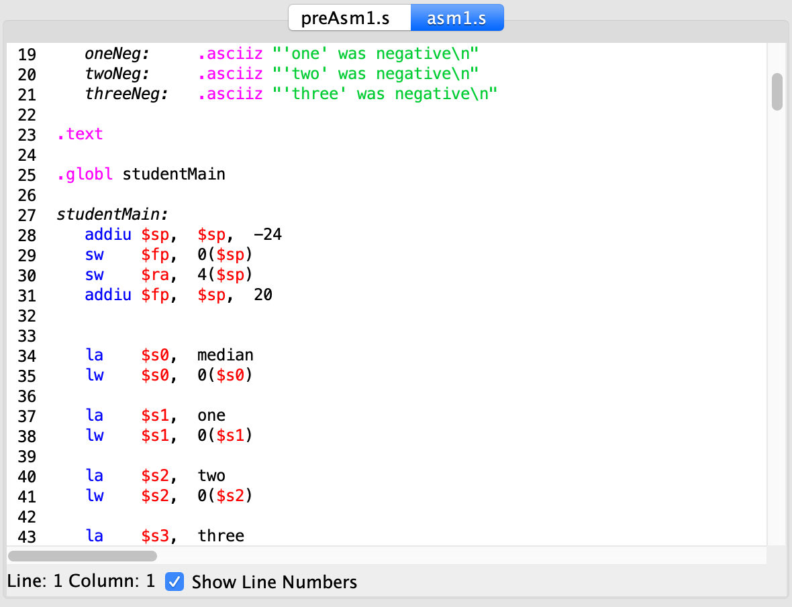

# MIPS-dollar-sign-autogen

This makes dollar signs automatically next to registers for MIPS. Please just make sure your code contains "___.globl___" and your input and output files have ___a different name or path___.

## Usage

To autogenerate dollar signs in your mips file:

    $ python mips.py  -i FILE --input=FILE \
                      -o FILE --output=FILE 

To see the argument options, run:

    $ python mips.py --help

which will print:

    usage: mips.py [-h] [--input INPUT_FILE_PATH] [--output OUTPUT_FILE_PATH]

        optional arguments:
        -h, --help            show this help message and exit
        -i INPUT, --input INPUT
                                path of the input file
        -o OUTPUT, --output OUTPUT
                                path of the output file

## Result

## Author

Sooyoung Moon / [@symoon94](https://www.facebook.com/msy0128) 